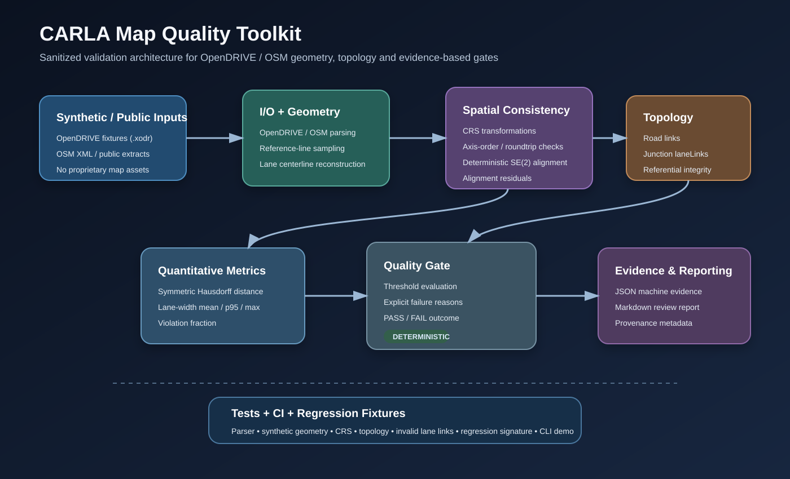
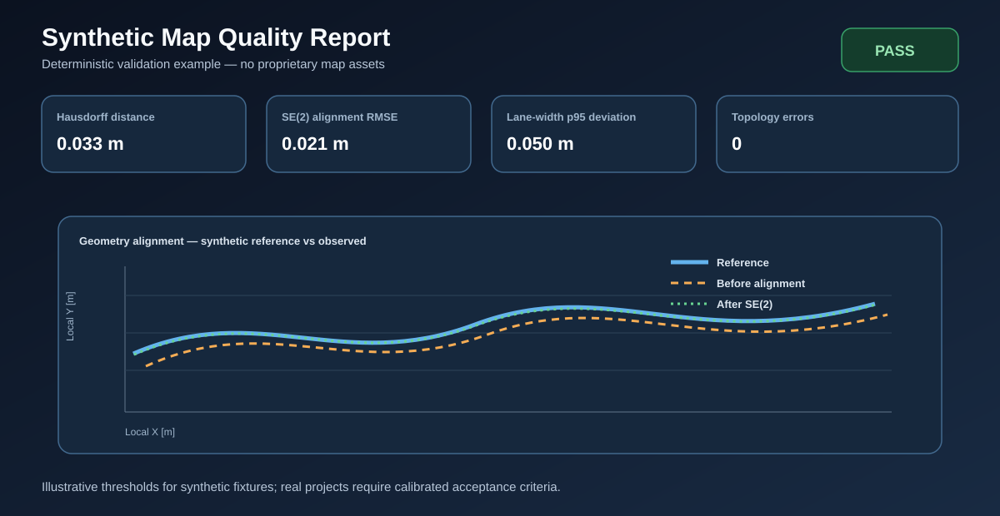

# carla-map-quality-toolkit

A sanitized, reproducible Python toolkit for **quality validation of road-network maps used in CARLA/OpenDRIVE workflows**. The repository is deliberately independent of private thesis assets, employer repositories, customer geometry and proprietary map exports.



## Engineering problem

Generated simulation maps can look plausible while still containing defects that cause routing, lane-following, spawning or downstream validation failures. Typical failure classes include:

- coordinate-reference-system or axis-order mistakes;
- rigid translation/rotation mismatch between map sources;
- excessive geometric deviation after alignment;
- incorrect or unstable lane widths;
- broken predecessor/successor references;
- junction lane links that point to non-existent lanes;
- undocumented map provenance or acceptance thresholds.

This toolkit converts those checks into **deterministic metrics, explicit topology findings and threshold-based quality gates**.

## Scope

The public project focuses on the validation layer, not on reproducing a private end-to-end map-generation pipeline. It uses generated OpenDRIVE/OSM fixtures and synthetic geometry. The code is designed to demonstrate the transferable engineering methods behind CARLA/OpenDRIVE map QA.

## Architecture

```text
Synthetic/Public Inputs
    │
    ├── OpenDRIVE (.xodr) ──► io/opendrive.py
    └── OSM XML (.osm) ─────► io/osm.py
                               │
                               ▼
                     Parsed road/lane data
                               │
               ┌───────────────┼────────────────┐
               ▼               ▼                ▼
          CRS checks       Geometry         Topology
          (pyproj)      lane/reference      validation
               │               │                │
               └──────► deterministic SE(2) ◄───┘
                               │
                               ▼
                      Metrics / deviations
                  Hausdorff + lane-width QA
                               │
                               ▼
                      Threshold quality gate
                               │
                  ┌────────────┴────────────┐
                  ▼                         ▼
             JSON evidence             Markdown report
                  │                         │
                  └──────────── CI / review ┘
```

A rendered version is in `docs/architecture.svg`.

## Package layout

```text
src/carla_map_quality_toolkit/
├── io/             # OpenDRIVE + OSM parsers
├── geometry/       # plan-view sampling + lane centerlines
├── crs/            # coordinate transformations / roundtrip sanity
├── alignment/      # deterministic SE(2) fitting
├── lane_quality/   # width-deviation statistics
├── topology/       # road/junction/lane-link integrity
├── metrics/        # Hausdorff geometry comparison
└── reporting/      # quality gates + JSON/Markdown evidence
```

## Metrics

| Check | Why it matters | Public implementation |
|---|---|---|
| CRS roundtrip | Detects CRS/axis-order setup mistakes | `crs.transform` |
| SE(2) alignment RMSE | Quantifies residual mismatch after rigid alignment | `alignment.se2` |
| Symmetric Hausdorff distance | Captures worst-case geometry separation | `metrics.hausdorff` |
| Lane-width p95 / max deviation | Detects local lane-width defects | `lane_quality.width` |
| Predecessor/successor integrity | Finds missing targets and broken reciprocal road links | `topology.validation` |
| Junction lane-link integrity | Finds links to lanes that do not exist | `topology.validation` |

## Quick start

```bash
python -m venv .venv
source .venv/bin/activate  # Windows: .venv\\Scripts\\activate
pip install -e ".[dev]"
pytest
carla-map-quality demo --output out
```

Expected demo result:

```text
PASS: wrote out/quality_report.json
```

## Synthetic input example

`tests/fixtures/minimal_valid.xodr` contains two generated roads and a junction. The fixture has constant 3.5 m driving lanes and valid lane links. `tests/fixtures/invalid_lane_link.xodr` intentionally references non-existent lanes and is expected to fail topology validation.

The OSM fixture in `tests/fixtures/synthetic.osm` is also generated for this repository. It is not a copy of a private or production map.

## Example quality report

The repository includes `docs/quality_report_example.md`, `docs/quality_report_example.json`, and a synthetic geometry plot:



Example gate excerpt:

```text
Gate: PASS
Symmetric Hausdorff:       ~0.03 m   (threshold <= 1.00 m)
SE(2) alignment RMSE:      ~0.02 m   (threshold <= 0.50 m)
Lane-width p95 deviation:  <0.05 m   (threshold <= 0.15 m)
Topology errors:           0         (threshold = 0)
```

Thresholds in this repository are **illustrative defaults for synthetic tests**, not universal CARLA acceptance criteria. Real projects must calibrate tolerances to map source, sampling density, intended simulation use and safety/validation context.

## Test strategy

The test suite includes:

- parser unit tests;
- synthetic line/lane geometry tests;
- WGS84 ↔ UTM CRS roundtrip tests;
- deterministic SE(2) recovery tests;
- Hausdorff known-offset tests;
- lane-width statistical tests;
- valid and invalid lane-link fixtures;
- a compact regression signature for the generated OpenDRIVE fixture;
- report gate pass/fail tests.

CI runs Ruff, pytest with coverage, and the synthetic command-line demo.

## Reproducibility and provenance

Every public example is generated from repository-owned fixtures. `io.provenance` provides SHA-256 input hashing, and quality reports include a `provenance` object so the source fixture, digest, generation mode and asset policy can be recorded alongside metrics. A production extension should also record CRS definitions, tool versions and pipeline configuration.

## Limitations

This is a portfolio-grade validation toolkit, not a complete OpenDRIVE engine. Current deliberate limitations include:

- plan-view sampling supports `line` and `arc` primitives, not every OpenDRIVE geometry type;
- lane centerlines are QA approximations based on lane widths/laneOffset rather than full road-surface reconstruction;
- Hausdorff distance is discrete and therefore depends on sampling density;
- SE(2) fitting assumes paired correspondences and does not implement ICP/outlier rejection;
- topology checks focus on referential integrity and do not prove legal traffic movements;
- thresholds are illustrative and must be calibrated per project;
- CARLA ingestion/runtime behavior is not simulated in unit tests.

These boundaries are documented so the repository demonstrates engineering judgment without overstating scope.

## Public-release policy

See [`SANITIZATION.md`](SANITIZATION.md). Do not add private map assets, employer/customer code, internal repository names, credentials or confidential benchmark data.

## Portfolio use

Role-targeted CV wording is provided in [`CARLA_PORTFOLIO_CV_BLOCK.md`](CARLA_PORTFOLIO_CV_BLOCK.md).
